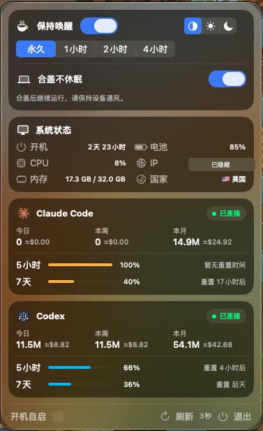

<div align="center">

# VibePulse

**为 Vibe Coding 打造的原生 macOS 菜单栏仪表盘**

在一个紧凑面板中掌握 AI 编程额度、本机 Token 用量与 Mac 运行状态。

[](https://github.com/ecokater/VibePulse/releases/latest)


[](LICENSE)

[下载最新版](https://github.com/ecokater/VibePulse/releases/latest) · [功能](#功能) · [数据与隐私](#数据与隐私) · [从源码构建](#从源码构建)

<br>



</div>

## 为什么选择 VibePulse

| AI 额度，一眼掌握 | Mac 持续运行 | 本地优先 |
| :--- | :--- | :--- |
| 同时查看 Claude Code 与 Codex 的连接状态、5 小时额度和 7 天额度。 | 按时长保持唤醒，并可独立启用合盖不休眠。 | Token 用量在本机统计，登录凭据不会被保存或展示。 |

VibePulse 将原本分散在不同客户端、日志与系统设置中的信息，收进一个随时可见的原生菜单栏面板。它适合长时间使用 Claude Code、Codex 和自动化开发流程的 macOS 用户。

## 功能

| 模块 | 能力 |
| --- | --- |
| **Claude Code 与 Codex** | 检测官方客户端连接状态，展示 5 小时 / 7 天剩余额度与重置时间 |
| **用量概览** | 汇总本机今日、本周、本月 Token，并显示 API 等价美元估值 |
| **保持唤醒** | 支持永久、1 小时、2 小时、4 小时防睡计时 |
| **合盖不休眠** | 独立开关，适合外接显示器或需要后台持续运行的场景 |
| **系统状态** | 查看 CPU、内存、电池、开机时长、公网 IP 与国家 |
| **外观** | 深色、浅色、跟随系统；macOS 26 使用原生 Liquid Glass 效果 |
| **自动刷新** | 每 5 分钟及 Mac 唤醒后刷新连接状态和订阅额度 |

## 安装

1. 从 [Releases](https://github.com/ecokater/VibePulse/releases/latest) 下载最新 DMG。
2. 打开 DMG，将 `VibePulse.app` 拖入“应用程序”。
3. 从“应用程序”启动 VibePulse。

> 当前发布版本未经过 Apple 公证。若 macOS 阻止首次打开，请在 Finder 中右键 VibePulse，选择“打开”。

## 数据与隐私

VibePulse 尽可能直接读取官方接口与本机数据，不搭建中转服务器。

| 数据 | 来源 |
| --- | --- |
| Claude 5 小时 / 7 天额度 | Anthropic 官方 OAuth 用量接口 |
| Codex 5 小时 / 7 天额度 | Codex 官方本地 `app-server` |
| Claude / Codex Token | 本机保存的官方客户端会话日志 |
| 美元估值 | 按日志模型和分类 Token，以公开 API 单价估算 |
| 系统状态 | macOS 本地系统接口 |
| 公网 IP 与国家 | `ipwho.is` |

- 所有 Token 用量统计均在本机完成。
- Claude OAuth 凭据仅从 macOS 钥匙串临时读取，并仅发送至 Anthropic 官方接口。
- Codex 额度通过官方本地服务读取。
- VibePulse 不保存、不展示 Claude 或 Codex 登录令牌。

> `≈$` 表示按公开 API 单价计算的等价价值，并非 Claude Pro、Codex Plus 等订阅的实际扣费。

## 使用说明

### Claude Code 登录

Claude Desktop 与 Claude Code 使用独立登录状态。VibePulse 会自动识别独立安装或 Claude Desktop 内置的 Claude Code。

```bash
claude auth login
```

如果终端中的 Claude Code 未继承系统代理，可为登录命令设置 `HTTPS_PROXY`、`HTTP_PROXY` 和 `ALL_PROXY`。

### 合盖不休眠

合盖不休眠首次使用需要管理员授权，之后由权限受限的本地助手切换。启用后请保持设备通风，不要将运行中的 Mac 放入电脑包。

## 从源码构建

要求 macOS 15 或更高版本，以及 Xcode 26 或兼容 Swift 6 工具链。

```bash
git clone https://github.com/ecokater/VibePulse.git
cd VibePulse
chmod +x build-app.sh
./build-app.sh
open dist/VibePulse.app
```

构建 DMG：

```bash
chmod +x build-dmg.sh
./build-dmg.sh
```

## 技术栈

`SwiftUI` · `ServiceManagement` · `Swift Package Manager` · `pmset` · `caffeinate`

## 注意事项

- 本机 Token 统计依赖官方客户端保留的会话日志。
- 模型价格可能变化，美元估值仅供参考。
- Claude Code、Claude、Codex、Anthropic 与 OpenAI 商标归各自所有。

## License

[MIT](LICENSE) © 2026 ecokater
